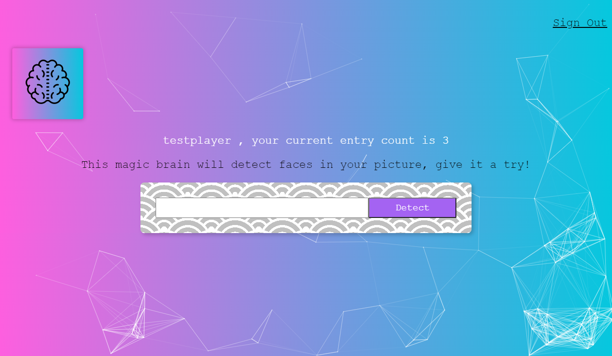

This project was bootstrapped with [Create React App](https://github.com/facebook/create-react-app).

The web application **Smart Brain** is the final project of the Udemy class [The Complete Web Developer in 2021: Zero to Mastery](https://www.udemy.com/course/the-complete-web-developer-zero-to-mastery/). The application is deployed current in [AWS](https://aws.amazon.com/). In the class, the application is deployed in [Heroku](https://www.heroku.com/).

The application is a classic web application which consists of three parts:
1. UI (React)
2. Backend (Node.js -> express)
3. Database (AWS RDS -> Postgresql)

The UI part is hosted by **AWS S3** as a static website. The bucked is public facing and the user can access the application via this [link](http://smartbrainaws.s3-website-us-east-1.amazonaws.com). 

The backend and database are hosted in a VPC of AWS. The database is hidden from the public and can only accessed by an EC2 instance in the same VPC.

**Note:** *This application does not match all security standards. E.g.: not SSL secured, as AWS S3 does not provide HTTPS for the buckets which are configured to be a static website host. In order to get a certificate for SSL, one can use e.g. Route53 to apply for a domain and certificate.*
 
 

 
 

## How to start?
You can start the application locally. In the project directory, you can run:

**Start the backend:**

    cd .\facerecognitionbrain\backend
    npm start

**Start the frontend:**

    cd .\facerecognitionbrain
    npm start

You might be asked if you want to use another port other than 3000, as 3000 might be used already by the backend. Just simply type "Y". It will use another port (e.g.: 3001) for the frontend.

Then you should be able to open the application via [http://localhost:3001](http://localhost:3000).

**Hint:** If it complains about missing module, you can run 

    npm install

for both backend and frontend parts.